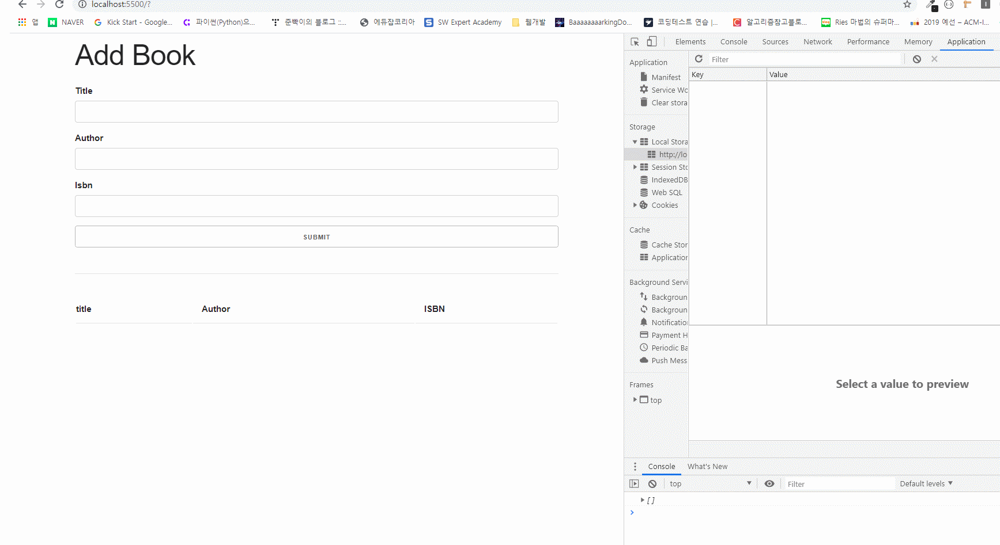

- 자바스크립트로 구현한 OOP Book List
  입니다

## 클래스 소개

- Book: 책 제목, 작가, isbn을 입력받아 새로운 책 객체를 생성
- UI: 생성된 책 객체를 화면에 추가하거나 이벤트 메세지를 보여주거나 (책 추가 완료, 혹은 에러메세지) 책을 리스트로부터 삭제하는 클래스
- Store: book list정보를 loccal storage를 통해 저장하고 조회하는 기능을 구현하는 클래스

## 구현한 기능

- 책 정보 추가, 삭제, 조회

- Local Storage를 이용하여 책 정보를 저장하여 책 데이터를 가져오기, 저장하기, 화면에 나타내기, 삭제하기 기능을 추가로 구현 (Store클래스)

- 프로토타입과 클래스를 공부하면서 두 가지 방식으로 미니 프로젝트 각각 구현

- app.js 파일은 프로토타입 기반으로 프로젝트 구현함
- appes6.js 파일은 클래스 기반으로 프로젝트 구현함
- index.html파일의 script에서 원하는 js파일의 소스를 지정해야한다
